# Video-to-3D — project report

A phone video of a static object goes in; a coloured point cloud with camera poses comes out,
together with an interactive viewer, an export, a run report and honest diagnostics. This report
walks through what was built, what was measured, what went wrong, and what the numbers do and do
not mean.

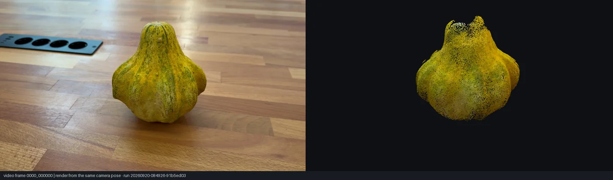

*Left: the first frame of the input video. Right: the reconstructed point cloud rendered from the
camera pose the reconstruction estimated for that frame. Run `20260920-084926-91b5ed03`.*

## At a glance

| | |
|---|---|
| Input | 26.5 s phone video, 1920×1080, of a patty-pan gourd on a wooden table |
| Output | coloured point cloud, 48 of 48 camera poses, object upright and centred |
| Reconstructor | VGGT (`facebook/VGGT-1B`), run on a separate GPU machine (NVIDIA RTX 5090) |
| Own work | everything around the model: frame selection, transfer contract, result ingest, world alignment, diagnostics, viewer, export, rendering, the P2 experiment |
| Experiment | smarter frame selection keeps the whole object under a strict confidence threshold, where uniform selection keeps fragments — verdict by a rule fixed before the runs |
| Tests | 552 automated tests on the Mac, no GPU needed |

## Contents

1. [What the tool does](#1-what-the-tool-does)
2. [First feasibility check (M1)](#2-first-feasibility-check-m1)
3. [World alignment](#3-world-alignment)
4. [Media rendering](#4-media-rendering)
5. [P2: does smarter frame selection help?](#5-p2-does-smarter-frame-selection-help)
6. [Honesty rules and limitations](#6-honesty-rules-and-limitations)
7. [Reproducing a run](#7-reproducing-a-run)
8. [Borrowed and built](#8-borrowed-and-built)
9. [What is next](#9-what-is-next)

---

## 1. What the tool does

The work is split into a **light stage** that runs on a laptop and a **heavy stage** that runs on
a GPU machine. They exchange files only; no project code runs on the GPU machine — it runs the
upstream reconstructor script as is.

| Step | Where | Command | Output |
|---|---|---|---|
| Check the video | Mac | `v3d check video.mp4` | supported or not, file properties |
| Select frames, build the transfer package | Mac | `v3d prepare video.mp4` | `runs/<run_id>/package/` with frames and `SHA256SUMS` |
| Reconstruct | GPU machine | upstream `demo_colmap.py` | COLMAP sparse model |
| Ingest and normalize | Mac | `v3d ingest runs/<run_id>` | aligned cameras and points, diagnostics, status |
| View | Mac | `v3d view runs/<run_id>` | interactive viewer (Rerun) |
| Export, report, media | Mac | `v3d export` · `v3d report` · `v3d media` | PLY, `report.md`, images and animations |

Every run lives in its own directory whose identity is a digest of the inputs (video hash,
parameters, code version, seed), so two runs never silently overwrite each other, and every
artifact carries the `run_id`.

The result type is stated literally everywhere: a **point cloud** — not a mesh, not a textured
model. The scale is **not determined**: there is no independent reference, so no metric accuracy
is claimed.

## 2. First feasibility check (M1)

The goal was declared before any code touched a GPU: *get a valid coloured point cloud and camera
poses from one real video.* It was reached — after three problems that are worth describing.

### 2.1 The upstream environment did not run on the GPU

The upstream `requirements.txt` pins `torch==2.3.1+cu121`, which has no kernels for the Blackwell
architecture (`sm_120`) of an RTX 5090: every GPU call fails with *no kernel image is available*.
Replacing it with a CUDA 12.8 build fixed it. The upstream demo also imports `pycolmap`,
`lightglue` and `hydra-core` at module level, so they are needed even without bundle adjustment.

### 2.2 Memory was measured, not guessed

The upstream README no longer lists memory use per frame count, so it was measured on two budgets:

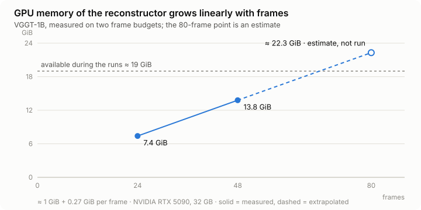

| Frames | Reconstructor memory | Time |
|---|---|---|
| 24 | 7.4 GiB | 31 s |
| 48 | 13.8 GiB | 31 s |
| 80 | ≈ 22.3 GiB (extrapolated, not run) | — |

About **1 GiB + 0.27 GiB per frame**. With roughly 19 GiB available during the runs, 80 frames
would not fit, so the default frame budget became **48** — a value justified by a measurement.

### 2.3 The default confidence threshold returned an empty cloud

The first real run returned 24 of 24 camera poses and **zero points**, with no error in the log.
In the upstream demo without bundle adjustment, points come from depth maps filtered by
`depth_conf >= conf_thres_value`, default **5.0** — and on this footage no point passed.

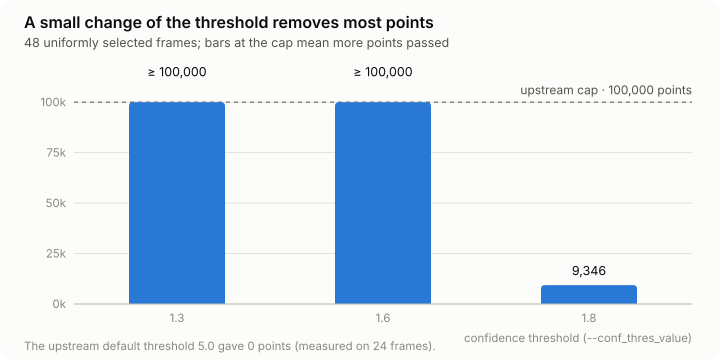

The number of points collapses between 1.6 and 1.8. Below 1.8 the count is pinned at the upstream
cap of 100,000 points, so **the count alone cannot show the effect of the threshold** — only the
composition of the cloud can. The working threshold became **1.6**: the object is recognizable and
most of the background is gone.

The tool handled the empty result as designed: status `invalid_result`, viewing and export
refused, the reason written down. An empty reconstruction was not presented as a success.

### 2.4 Result

48 of 48 cameras registered, the orbit covered 334° of the circle, the object clearly recognizable. The render from a
reconstructed camera pose lines up with the real video frame:

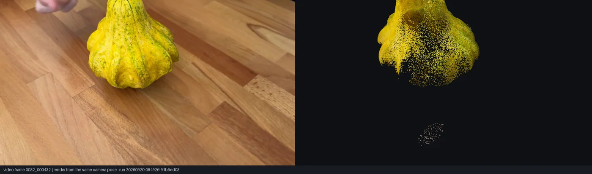

This pairing is the end-to-end check of the coordinate conventions: had any transform between the
reconstructor, the ingest and the renderer been wrong, the object would be shifted, mirrored or
upside down on the right.

## 3. World alignment

### 3.1 The problem

The first result looked tilted by about 45° and orbited around an empty point in the viewer. Not a
bug: the reconstructor anchors its world to **the first camera**, so the whole scene inherits the
angle at which the phone was held. There is no gravity in the data.

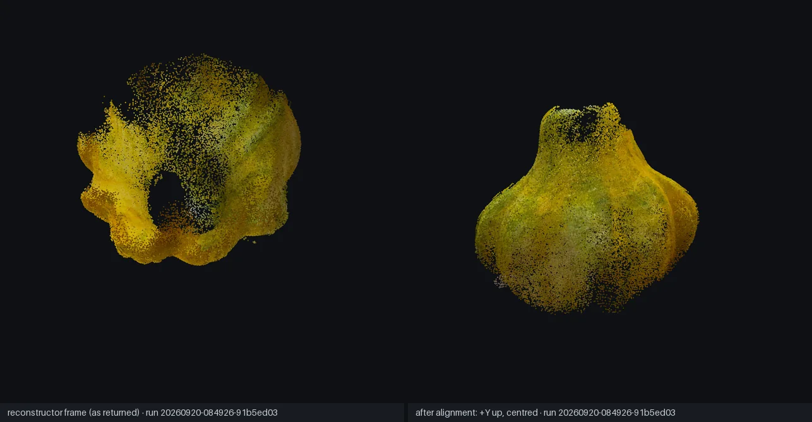

### 3.2 The method

- **Vertical** — the normal of the plane fitted to the camera **centres**. A handheld orbit keeps
  the cameras close to one plane; positions do not depend on the camera's roll, so an unlevelled
  horizon does not bias the estimate.
- **Sign** — the side the average camera "up" points to.
- **Centre** — the point nearest to all optical axes: every camera looks at the object, so the
  background does not pull it.
- **Rotation about the vertical** — fixed so the first camera is in front, which makes renders
  comparable with the first video frame.
- **Quality gate** — planarity of the orbit, angular coverage, agreement of the sign. If the gate
  fails, the result is only re-centred and a warning is issued.

The transform is recorded with the result, labelled *estimated from the camera trajectory, not
measured*; the original frame is recoverable, and the raw reconstructor output is never modified.

| Run | Planarity (s3/s2) | Arc coverage | Sign agreement |
|---|---|---|---|
| 24 frames | 0.052 | 319° | 0.773 |
| 48 frames | 0.055 | 334° | 0.772 |

Two independent reconstructions of the same video give almost the same vertical.

### 3.3 A bug the tests caught

The arc coverage was first measured around the **centroid of the cameras**. For a full orbit that
is the ring centre, but for a partial orbit the centroid slides inside the arc, and a half orbit
measured as about 243° — the gate would have accepted an incomplete capture. Coverage is now
measured around the **object centre**, and a test documents why.

## 4. Media rendering

All images in this report are produced by `v3d media` from stored run artifacts, on the CPU:
pinhole projection, a z-buffer, supersampling for smooth edges and mild depth shading. No GPU and
no plotting library.

| Front | Three-quarter | Top |
|---|---|---|
| 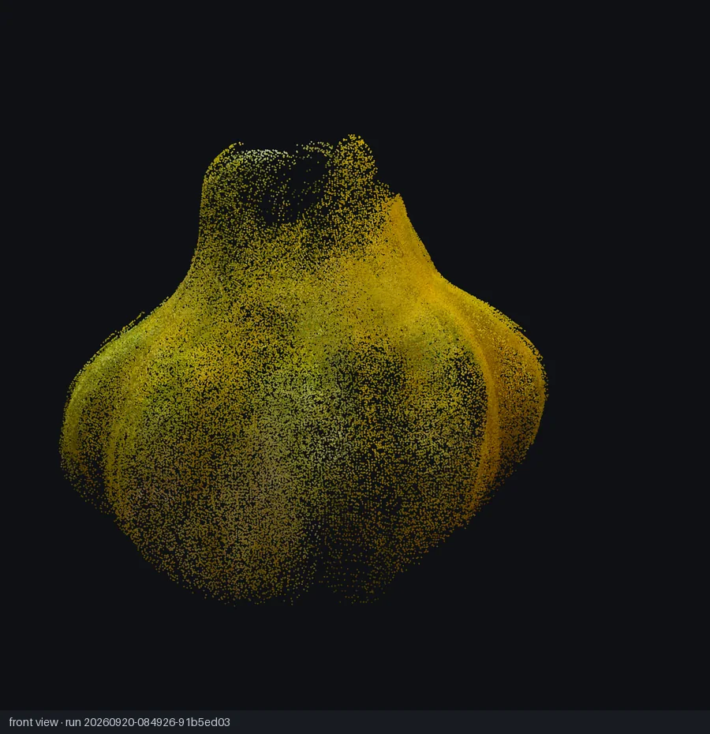 | 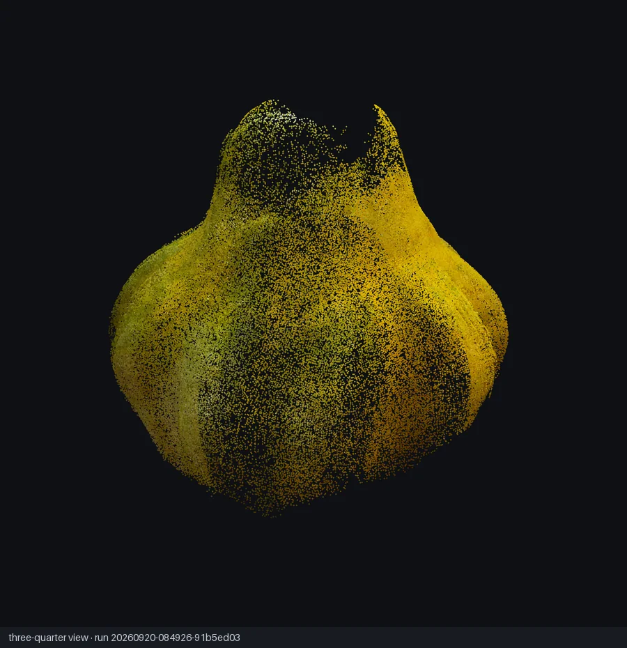 | 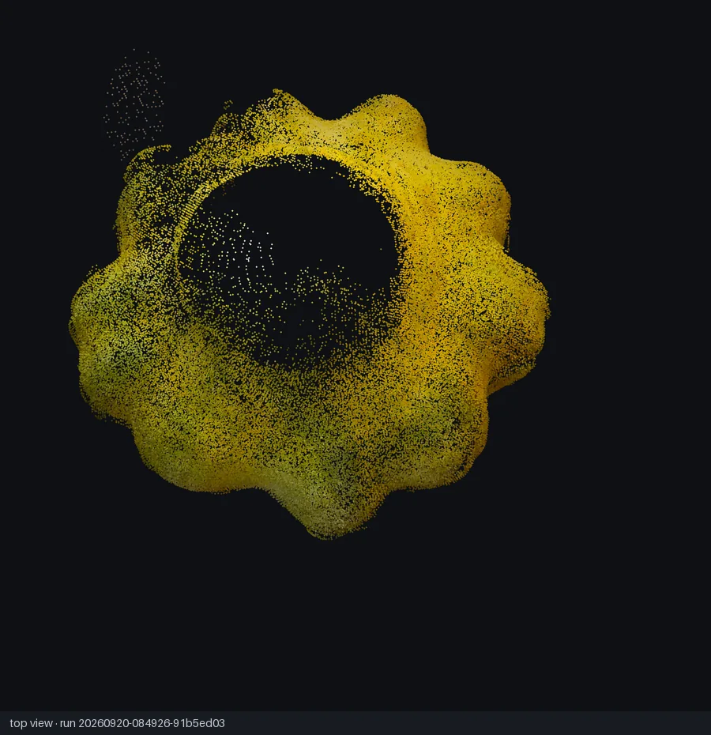 |

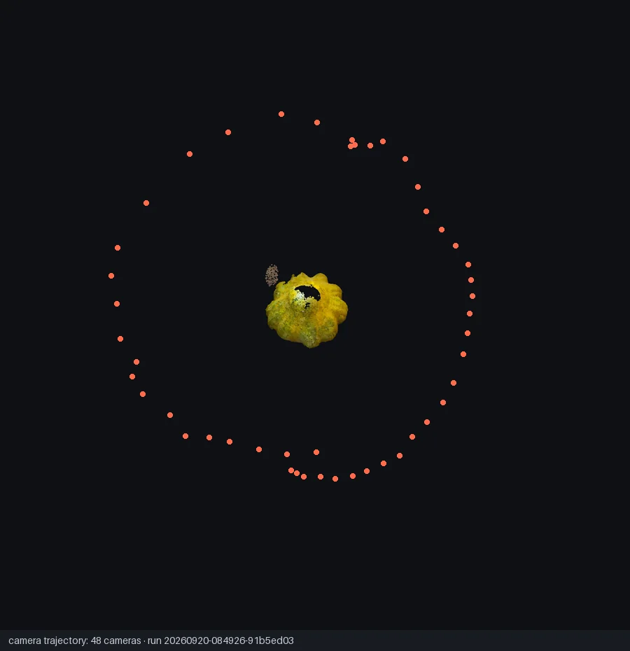

*48 cameras in a ring around the object. The gap at the upper left is the part of the orbit the
capture did not cover (coverage 334°).*

The top view shows the one visible defect of the typical run: the top of the object is sparse —
few frames looked at it from above. It is recorded in the run's visual check.

## 5. P2: does smarter frame selection help?

### 5.1 The question and the method

With the same video, the same budget of 48 frames and the same reconstructor: does choosing sharp
frames while avoiding near-duplicate viewpoints beat uniform sampling in time?

The variant splits the video into 48 windows and takes the sharpest frame of each window unless it
looks too similar to the previous pick. One frame per window keeps all viewpoints — a global
"sharpest frames" ranking would crowd the selection where the camera moved slowly.

### 5.2 How the comparison was protected against self-deception

- **The decision rule was committed before the runs.** The commit with the conditions precedes the
  commit with the results in the repository history.
- **The redundancy threshold was tuned on a different video**, not on the evaluation video.
- **The baseline was run twice** to measure run-to-run variation.
- **A stress-test threshold of 1.8 was used for all branches.** At the working threshold 1.6 both
  branches would hit the 100,000-point cap and the comparison could show nothing.

### 5.3 Result

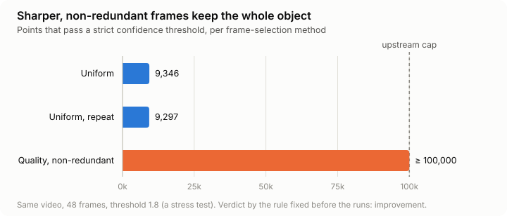

| | Uniform | Uniform, repeat | Quality, non-redundant |
|---|---|---|---|
| Cameras | 48 / 48 | 48 / 48 | 48 / 48 |
| Points at 1.8 | 9,346 | 9,297 | **≥ 100,000** (cap) |
| Visual defects | 2 | 2 | 1 |
| Selection cost | 0.16 s | — | 1.19 s |

| Uniform at 1.8 | Quality at 1.8 |
|---|---|
| 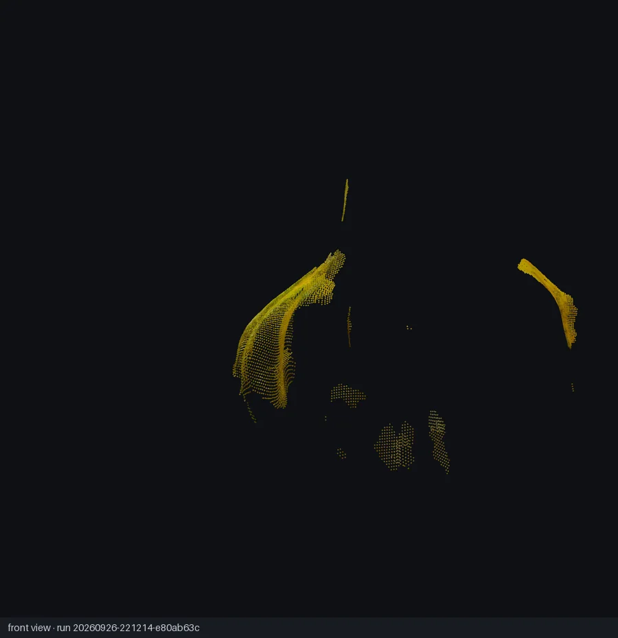 | 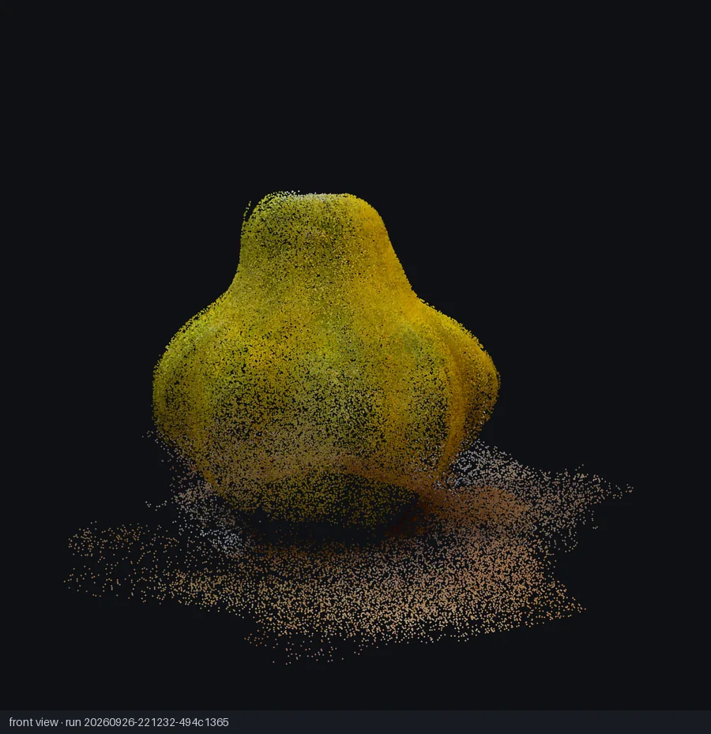 |

**Verdict: improvement.** Under the strict threshold, uniform selection keeps scattered fragments
of the object; the variant keeps the whole object, with a disc of table surface beneath it. The two
baseline runs differ by 0.5 %, so this is not noise.

### 5.4 How to read it

- **The ×10 is a lower bound and depends on the threshold.** The variant hit the cap, so its true
  count is higher; and 1.8 sits on a cliff where a moderate gain in depth confidence becomes a huge
  jump in the count. The claim is not "ten times better geometry" but "the object survives a strict
  threshold with these frames and does not with uniform ones".
- **At the working threshold 1.6 the uniform branch is already complete**; the variant was not run
  at 1.6.
- **The mechanism is not established.** The variant's frames are only 5 % sharper by median and 39
  of 48 frames differ; a few blurred or occluded frames in the uniform set could explain it.
- **Selection costs about a second**, about 3 % of one reconstruction.
- **One video.** No generalization is claimed.

Full details: [`docs/p2-experiment.md`](../p2-experiment.md) and
[`experiments/p2_pumpkin_48/comparison.md`](../../experiments/p2_pumpkin_48/comparison.md).

## 6. Honesty rules and limitations

The project follows a written constitution; the rules that shaped this report:

- The result type is stated literally; a point cloud is never called a mesh.
- Unavailable metrics are marked with a reason, never replaced by zero. Without bundle adjustment
  the reprojection error is unavailable, and the report says so.
- Warnings describe observations, not causes: "many frames are blurry — the result may be
  incomplete", not "the camera moved too fast".
- Thresholds are not assigned before a measurement justifies them; preliminary values are marked.
- A negative result is a valid outcome and would have been reported the same way.

**Limitations of the current version**

- Scale is not determined; no metric accuracy or surface completeness is claimed.
- The background is not removed; a residual background is expected and marked.
- The vertical is estimated from the camera trajectory, not measured.
- Supported input: MP4 / MOV with H.264 / HEVC; one static, rigid, opaque, textured object.
- Everything was measured on one real capture.

## 7. Reproducing a run

On the Mac:

```bash
brew install ffmpeg
make install
.venv/bin/v3d prepare video.mp4 --out runs          # prints the run_id and the package path
```

Copy `runs/<run_id>/package/` to a machine with an NVIDIA GPU that has the upstream VGGT repository
installed with a CUDA 12.8 PyTorch build, check it with `sha256sum -c SHA256SUMS`, then run:

```bash
python demo_colmap.py --scene_dir=<path to package> --conf_thres_value 1.6
```

Copy the resulting `sparse/` directory back into `runs/<run_id>/result/`, then on the Mac:

```bash
.venv/bin/v3d ingest runs/<run_id>
.venv/bin/v3d view runs/<run_id>
.venv/bin/v3d report runs/<run_id>
.venv/bin/v3d media runs/<run_id>
```

The instructions for recording a suitable video are in
[`docs/shooting-guide.md`](../shooting-guide.md).

## 8. Borrowed and built

| Borrowed | Why |
|---|---|
| VGGT and the `VGGT-1B` weights (non-commercial licence) | reconstruction in one forward pass |
| COLMAP sparse format, `pycolmap` | the result contract and its reader |
| Rerun | the interactive viewer |
| ffmpeg / ffprobe | decoding, orientation, animations |

**Built in this project**: frame extraction with real timestamps and orientation handling; the two
frame-selection methods and the P2 comparison; the transfer package with integrity checks; the
ingest with status handling for empty, partial and interrupted results; world alignment; the
diagnostics and the run report; the renderer and the media pipeline; the viewer layout; a
synthetic scene generator with known ground truth used to test every geometric convention.

## 9. What is next

- Run P2 on harder videos and at a second budget.
- Measure below the upstream cap (a lower threshold for both branches) to size the effect without
  saturation.
- Bundle adjustment, to make the reprojection error available.
- Optional background separation after reconstruction, as a viewing aid.
